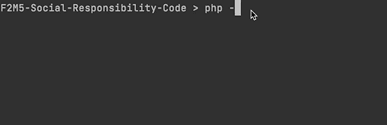

# {{ page.title }}

Zorg dat je het commando `php` overal in een terminal (cmd venster) kunt uitvoeren

Kijk deze video's om te zien hoe je dat voor elkaar krijgt:

### Windows


### Mac
Als je XAMPP op de Mac hebt of MAMP dan zou ph pal moeten werken in de Terminal.
Probeer het commando: `php -v` en kijk of je een versie nummer krijgt.

- Kijk anders [hier voor XAMPP instructies](http://bap.mediadeveloper.amsterdam/installatie-en-setup/xampp-mac/){: target="blank" }
- [Kijk hier voor MAMP instructies](http://bap.mediadeveloper.amsterdam/installatie-en-setup/mamp-mac/){: target="blank" }

