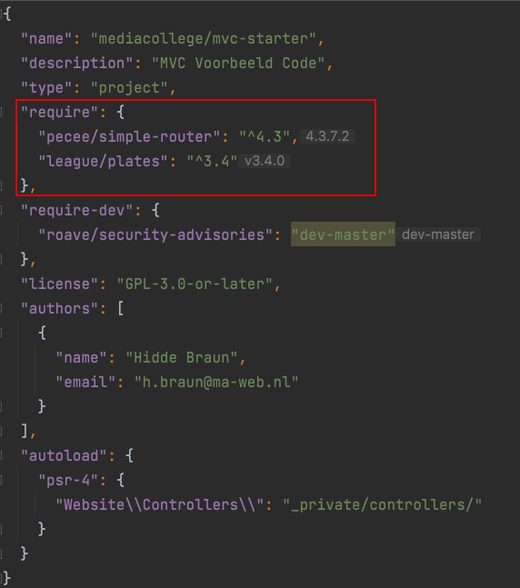

# {{ page.title }}

Heb je composer werkend dan kun je de benodigde externe code die in het project gebruikt wordt gaan installeren.

In het bestand `composer.json` staat gedefinieerd welke packages we gebruiken:

## Installeren van deze dependencies
- Open een terminal in de proejct folder
- Installeer de *dependencies* met `composer install`
- Er komt een `vendor` map waar alle dependencies in worden gezet



