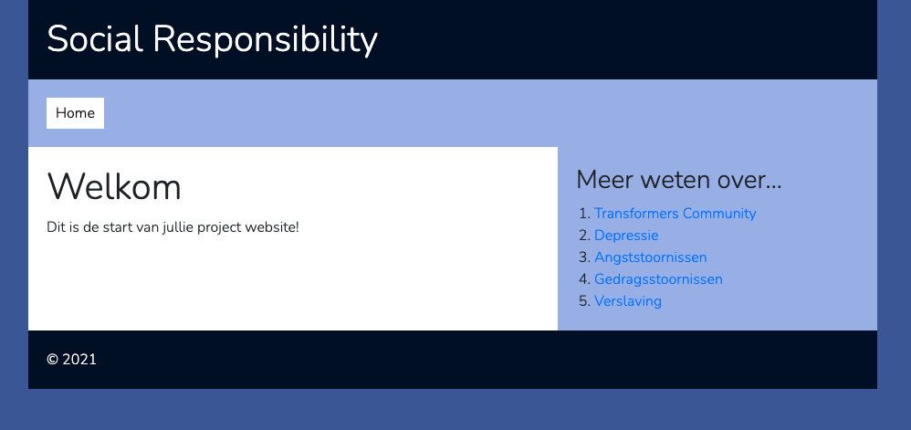

# {{ page.title }}

Nu heb je alle code om het project te laten werken.

## Config bestand maken
Dit project heeft een aantal instellingen waarmee je het project kunt configureren. Zoals bijvoorbeeld de database gegevens.

Er is een voorbeeld `config.example.php` bestand, maar je moet eerst een eigen `config.php` maken met jouw instellingen.

Daarvoor moet je het volgende doen:
- Maak een kopie van het bestand `_private/includes/config.example.php` en hernoem die naar `config.php`.

## Project zien via localhost

Er zijn twee manieren om het project op localhost te laten werken, kies één van deze twee manieren

### 1. Via XAMP / MAMP webserver
{: .text-blue-000 }

- De map moet dan alleen ergens onder je htdocs staan
- Open de url in je browser (je krijgt een fout nu nog)

*Instellingen doen voor MAMP/XAMP*

- Het project maakt gebruik van een externe *router* component die alle URL's afhandelt voor jouw website.
- Deze heb je net geïnstalleerd met composer als het goed is.
- Deze component moet weten waar jouw project "begint" (de url vanaf http://localhost)
- Staat je project bijvoorbeeld op `http://localhost/social-responsibility`
- Open dan `_private/includes/config.php`
- Pas de waarde van de `BASE_URL` instelling aan naar `'/social-responsibility/'`
    - Dus: `'BASE_URL' => '/social-responsibility/'`
- Nu kun je als het goed is (eindelijk) de homepage zien in je browser.

### 2. Via de ingebouwde PHP webserver
{: .text-blue-000 }

In PHP zit ook een simpele ingebouwde webserver. Die kun je tijdens de ontwikkeling gebruiken.
(hiervoor moet PHP dus werken op de command line)

De webserver start je als volgt op:

- Open een terminal venster in de project folder
- Voer nu het commando uit: `php -S localhost:8000`
- Laat dit commando op de achtergrond draaien (anders stopt de webserver)
- De website is nu te zien op http://localhost:8000
- Stop de webserver als je klaar bent, met CTRL+C



---
## Poeh!

Als het goed is zie je nu deze vrij lege homepage.

**Gefeliciteerd je hebt alles gereed en bent klaar om aan de slag te gaan!**
{: .text-green-100 .fs-6 }

